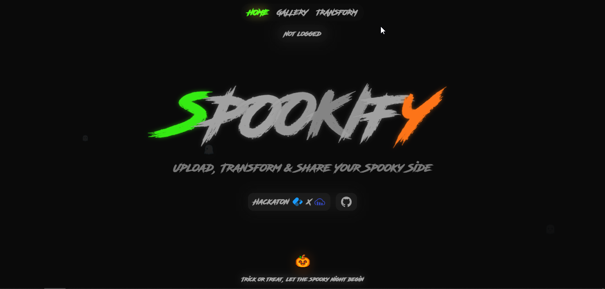

# Spookify 🎃👻

**Spookify** is a platform that adds horror-themed backgrounds to your images, giving them a spooky, eerie touch. Perfect for enhancing photos with a creepy atmosphere for Halloween or any scary-themed project.

    

---

## Hackathon Participation 💻

This project is part of the hackathon hosted by **Cloudinary** and **Midudev**, where we explore innovative ways to add thematic backgrounds and optimize multimedia content.

---

### Technologies

-  **Next.js** for server-side rendering and frontend development.
-  **Next-Cloudinary** for seamless Cloudinary integration.
-  **Tailwind CSS** for responsive, utility-first styling.
-  **Cloudinary** for image optimization and background management.

---

### How to Contribute?

1. Fork the repository.
2. Create a new branch with your changes.
3. Submit a pull request.

---

Thanks for visiting and enjoy adding horror backgrounds to your images with Spookify! 🎃
